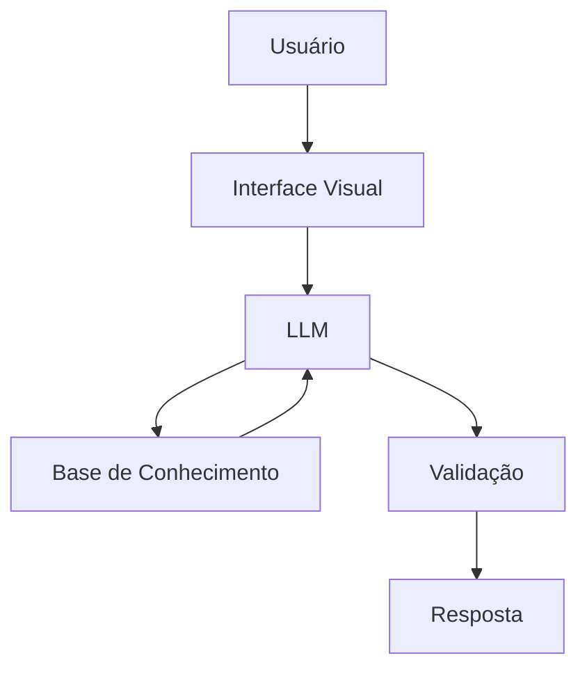

## Caso de uso

## Problema  
Muitas pessoas têm dificuldade em organizar suas finanças pessoais e entender como fazer uma reserva de emergência e tipos de 
investimentos.

## Solução  
Esse agente educativo explica conceitos financeiros de forma simples, usando os dados do próprio cliente como exemplo prático, 
mas sem dar recomendações de investimento.

## Público-alvo  
Pessoas sem conhecimento em financas pessoais e que querem organizar sua vida financeira.

## Persona

### Nome do Agente

### Personalidade  
- Educativo
- Usa exemplos práticos
- Não julga os gastos do usuário
- Paciente
- Colaborativo

### Tom de comunicação   
Informal e didático

## Arquitetura 
### Diagrama

### Componentes

|Componente|	Descrição|
|---|---|
|Interface|	Streamlit|
|LLM|	Ollama (local)|
|Base de Conhecimento	|JSON/CSV mockados na pasta data|

## Segurança

### Estratégia adotada
- Só usa dados fornecidos no contexto pelo usuário
- Não recomenda investimentos específicos
- Admite quando não sabe algo
- Foca apenas em educar, não em aconselhar

### Limitações
- NÃO faz recomendação de investimento
- NÃO acessa dados bancários sensiveis (como senhas etc)
- NÃO substitui um profissional certificado

